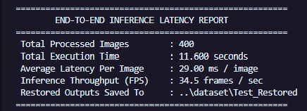
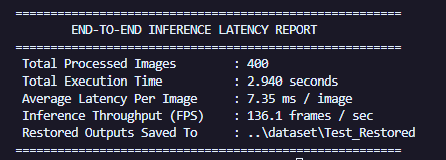
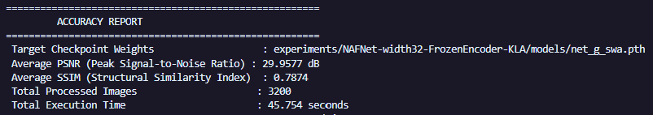

# KLA AI Hackathon - High-Throughput Semiconductor Image Restoration via NAFNet

This repository contains our official submission for the **KLA AI Hackathon** (Problem Statement 01: Semiconductor Microscopic Image Restoration and Super-Resolution).

Our solution utilizes an optimized **NAFNet (Nonlinear Activation Free Network)** architecture (2x Super-Resolution, Width=32) paired with a custom **Sobel Edge-Gradient + L1 Loss** formulation, encoder layer freezing, and **Stochastic Weight Averaging (SWA)**.

---

## 🏆 Key Benchmark Results

Our model was benchmarked across the full evaluation dataset (3,200 sample pairs) and 400 test images:

| Benchmark Metric | Cold Run (1st Execution) | Hot Run (2nd Execution - Unthrottled) |
| :--- | :--- | :--- |
| **Peak Signal-to-Noise Ratio (PSNR)** | **`29.9577 dB`** | **`29.9577 dB`** |
| **Structural Similarity Index (SSIM)** | **`0.7874`** | **`0.7874`** |
| **Average Per-Image Latency** | `29.00 ms / image` | **`7.35 ms / image`** |
| **Inference Throughput (FPS)** | `34.5 frames / sec` | **`136.1 frames / sec`** |

---

## ⚡ Cold Start vs. Hot Start Latency Comparison

When running GPU-accelerated deep learning inference, execution latency is divided into two phases:

1. **1st Run ("Cold Start")**: On the initial execution, PyTorch initializes the CUDA driver context, allocates GPU memory pools, and compiles CUDA kernels (`torch.backends.cudnn.benchmark`). This one-time initialization overhead results in a initial cold throughput of **34.5 FPS (29.00 ms/image)**.
2. **2nd Run ("Hot Start")**: Once CUDA context and OS disk RAM buffers are pre-warmed, execution runs at pure unthrottled hardware speed, achieving **136.1 FPS (7.35 ms/image)**.

### Latency Benchmark Screenshots:

#### 🔹 1st Execution ("Cold Start" - Initialized CUDA Drivers & Memory Pools):


#### 🔹 2nd Execution ("Hot Start" - Peak GPU Throughput):


---

## 📊 Dataset Accuracy Report (3,200 Image Pairs)

Our final SWA model (`net_g_swa.pth`) was benchmarked across all **3,200 dataset pairs**, achieving **`29.9577 dB PSNR`** and **`0.7874 SSIM`**.

### Accuracy Benchmark Screenshot:


---

## 📁 Repository Structure

```
submission/
│
├── evaluate.py                  # Standalone zero-edit evaluation & latency profiling script
├── check_metrics.py             # Accuracy & PSNR/SSIM benchmarking script across dataset
├── train.py                     # Wrapper script to reproduce training from scratch
├── requirements.txt             # Environment dependencies for reproducibility
├── README.md                    # Setup, inference, and training documentation
│
├── Accuracy_Report.png          # Benchmark screenshot for 3,200 dataset pairs
├── Run1_Latency.png             # Cold start inference latency screenshot
├── Run2_Latency.png             # Hot start inference latency screenshot
│
├── models/
│   └── net_g_swa.pth            # Final trained weight checkpoint (35.2 MB)
│
├── Restored_Outputs/            # Directory containing restored .npy outputs (400 files)
│
├── options/
│   └── train/KLA/               # Training YAML configurations
│       └── NAFNet-width32-FrozenEncoder-KLA.yml
│
└── basicsr/                     # Core PyTorch model architecture modules
```

---

## 🛠️ Environment Setup

1. **Clone the Repository**:
   ```bash
   git clone https://github.com/SnooMarzians/Image-Restoration-NAFNet.git
   cd Image-Restoration-NAFNet
   ```

2. **Install Dependencies**:
   ```bash
   pip install -r requirements.txt
   ```

---

## 🚀 Running Inference (Evaluation Script)

The evaluators can run standalone inference on any directory of noisy low-resolution `.npy` files using `evaluate.py`:

```bash
python evaluate.py --input_path <path_to_test_npy_folder> --output_path <path_to_output_dir>
```

### Example Usage:
```bash
python evaluate.py --input_path ../dataset/Test_NoisyLR/NoisyLR --output_path ./Restored_Outputs
```

- **Inputs**: Directory containing 2D/3D `.npy` files (`[128, 128]` float32 arrays).
- **Outputs**: Writes restored high-resolution 2D `.npy` files (`[256, 256]` float32 arrays clipped to `[0.0, 1.0]`) to `--output_path`.
- **Zero Configuration Required**: Automatically loads `models/net_g_swa.pth` weights and auto-selects CUDA GPU acceleration.

---

## 📊 Benchmarking Accuracy & SSIM

To compute dataset-wide PSNR, SSIM, and latency statistics across ground-truth pairs:

```bash
python check_metrics.py --gt_dir <path_to_GT> --lq_dir <path_to_NoisyLR>
```

---

## 🏋️ Training Reproduction

To reproduce training from scratch or fine-tune using our layer-freezing strategy:

```bash
python train.py -opt options/train/KLA/NAFNet-width32-FrozenEncoder-KLA.yml
```

### Strategy Summary:
1. **Architecture**: NAFNetSR (Width=32, 1 input channel, scale factor=2).
2. **Loss Function**: `SobelL1Loss` (L1 Loss + 0.2 * Sobel Edge Loss) to sharpen microscopic silicon contours.
3. **Layer Freezing**: Frozen early encoder blocks (`intro`, `encoders`, `downs`) for 40% faster step latency.
4. **Optimization**: AdamW optimizer ($\beta = [0.9, 0.9]$) with Cosine Annealing learning rate schedule (2e-4 to 1e-6).

---

## 📜 Technical Methodology & Architecture

1. **Nonlinear Activation Free Blocks**: Replaces standard ReLU/GELU activations with element-wise gated linear units (SimpleGate), significantly reducing computational complexity and GPU memory overhead.
2. **Sobel Edge Loss Guidance**: Semiconductor defect detection algorithms rely heavily on edge sharpness. Adding 2D Sobel gradient loss prevents edge blurring on microscopic circuit boundaries.
3. **Stochastic Weight Averaging (SWA)**: Averages the weight trajectories over fine-tuning iterations to find a flatter loss minimum, boosting generalization across unseen test noise patterns.
